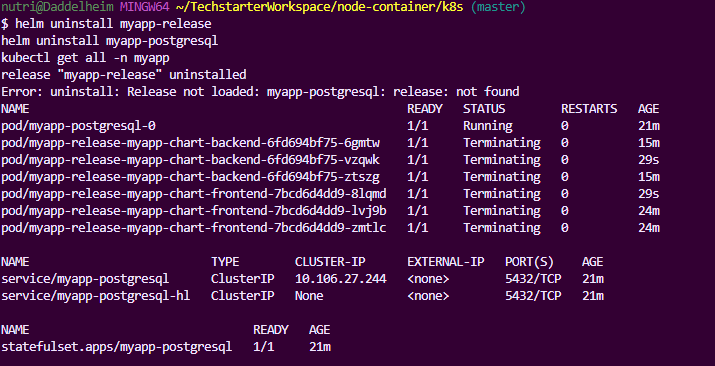

# Mini-Notizblock - Fullstack Kubernetes Application with Helm

## Projektbeschreibung

Dieses Projekt demonstriert die Deployment einer vollständigen Fullstack-Anwendung in Kubernetes mit Helm Charts. Die Anwendung besteht aus:

- **Frontend**: React Anwendung (Nginx)
- **Backend**: Node.js REST API mit Express
- **Datenbank**: PostgreSQL (Bitnami Helm Chart)
- **Ingress**: Nginx Ingress Controller für externen Zugriff
- **Schema-Migration**: Automatisierte Datenbank-Initialisierung mit Helm Hooks

## Technologie-Stack

- **Container**: Docker
- **Orchestration**: Kubernetes
- **Package Manager**: Helm 3
- **Ingress**: Nginx Ingress Controller
- **Database**: PostgreSQL 17 (Bitnami Chart)
- **Frontend**: Nginx + Static Files
- **Backend**: Node.js + Express + PostgreSQL
- **CI/CD**: Automatische Schema-Migration via Helm Jobs

## Abgabe-Screenshots

### 1. Helm Release Installation


_Screenshot zeigt erfolgreich installierte Helm Releases mit `helm list`_

### 2. Kubernetes Objekte


_Screenshot zeigt alle deployten Kubernetes-Objekte inklusive Pods, Services, Deployments und PVC_

### 3. Job-Status (Schema-Migration)


_Screenshot zeigt den automatischen Database-Init-Job, der das Schema erstellt_

### 4. Anwendung funktioniert


_Screenshot zeigt erfolgreichen API-Zugriff über Ingress mit `curl http://myapp.local/api/notes`_

### 5. Helm Upgrade


_Screenshot zeigt Upgrade mit geänderten Replikazahlen_

### 6. Deinstallation



_Screenshot zeigt vollständige Deinstallation aller Komponenten_

## Helm Chart Struktur

```
myapp-chart/
├── Chart.yaml                   # Chart Metadaten und Dependencies
├── values.yaml                  # Standard-Konfiguration (NICHT für Production!)
├── values-example.yaml          # Sichere Beispiel-Konfiguration
├── templates/
│   ├── namespace.yaml          # Namespace Definition
│   ├── backend-deployment.yaml # Backend Deployment
│   ├── frontend-deployment.yaml# Frontend Deployment
│   ├── backend-service.yaml    # Backend Service
│   ├── frontend-service.yaml   # Frontend Service
│   ├── ingress.yaml            # Ingress Configuration
│   ├── secrets.yaml            # Database Credentials
│   ├── frontend-configmap.yaml # Nginx Configuration
│   ├── db-init-job.yaml        # Automatische Schema-Migration (Helm Hook)
│   └── _helpers.tpl            # Template-Hilfsfunktionen
└── charts/                     # Abhängigkeiten (PostgreSQL wird extern installiert)
```

## Voraussetzungen

### System-Requirements

```bash
# Kubernetes Cluster (Docker Desktop, Minikube, etc.)
kubectl version

# Helm 3 installiert
helm version

# Docker für Image-Building
docker --version
```

### Nginx Ingress Controller installieren

```bash
# Ingress Controller installieren
kubectl apply -f https://raw.githubusercontent.com/kubernetes/ingress-nginx/controller-v1.8.1/deploy/static/provider/cloud/deploy.yaml

# Installation überprüfen
kubectl get pods -n ingress-nginx

# Für lokale Entwicklung (Docker Desktop)
kubectl wait --namespace ingress-nginx \
  --for=condition=ready pod \
  --selector=app.kubernetes.io/component=controller \
  --timeout=120s
```

## Installation

### 1. Repository klonen

```bash
git clone https://github.com/YOUR_USERNAME/YOUR_REPO.git
cd YOUR_REPO/k8s
```

### 2. Dependencies vorbereiten

```bash
# Bitnami Repository hinzufügen
helm repo add bitnami https://charts.bitnami.com/bitnami
helm repo update

# Chart Dependencies aktualisieren
helm dependency update myapp-chart
```

### 3. PostgreSQL installieren (Separate Installation empfohlen)

```bash
# PostgreSQL im korrekten Namespace installieren
helm install myapp-postgresql bitnami/postgresql \
  --namespace myapp \
  --create-namespace \
  --set auth.username=meinnotizblockuser \
  --set auth.password=EinSehrSicheresPasswort! \
  --set auth.database=notizblock_prod_db \
  --set persistence.enabled=true \
  --set persistence.size=1Gi \
  --set primary.resources.limits.memory=1Gi \
  --set primary.resources.limits.cpu=1000m \
  --set primary.resources.requests.memory=512Mi \
  --set primary.resources.requests.cpu=500m
```

### 4. Anwendung installieren

```bash
# Mit sicheren Credentials (Development)
helm install myapp-release myapp-chart \
  --create-namespace \
  --set backend.image.repository=mephisto1339/backend-image \
  --set frontend.image.repository=mephisto1339/frontend-image \
  --set backend.env.dbUser=meinnotizblockuser \
  --set backend.env.dbName=notizblock_prod_db \
  --set secrets.dbCredentials.data.POSTGRES_PASSWORD=EinSehrSicheresPasswort! \
  --set secrets.dbCredentials.data.POSTGRES_USER=meinnotizblockuser \
  --set secrets.dbCredentials.data.POSTGRES_DB=notizblock_prod_db
```

### 5. Hosts-Datei konfigurieren

```bash
# Windows: C:\Windows\System32\drivers\etc\hosts
# Linux/Mac: /etc/hosts
127.0.0.1 myapp.local
```

## Automatische Schema-Migration

Das Chart enthält einen automatischen Database-Init-Job (`templates/db-init-job.yaml`), der:

- **Helm Hook**: Läuft automatisch nach `helm install` und `helm upgrade`
- **Wartet auf PostgreSQL**: Verwendet `pg_isready` für Health-Check
- **Erstellt Schema**: notes-Tabelle mit Triggern für Timestamps
- **Fügt Beispieldaten ein**: Nur wenn Tabelle leer ist
- **Auto-Cleanup**: Job wird nach erfolgreichem Abschluss gelöscht

```yaml
annotations:
  "helm.sh/hook": post-install,post-upgrade
  "helm.sh/hook-weight": "1"
  "helm.sh/hook-delete-policy": before-hook-creation,hook-succeeded
```

## Zugriff auf die Anwendung

- **Frontend**: http://myapp.local/
- **Backend API**: http://myapp.local/api/notes
- **Health Check**: http://myapp.local/api/health

### API-Endpunkte

```bash
# Alle Notizen abrufen
curl http://myapp.local/api/notes

# Neue Notiz erstellen
curl -X POST http://myapp.local/api/notes \
  -H "Content-Type: application/json" \
  -d '{"text": "Neue Notiz via API", "is_done": false}'

# Notiz aktualisieren
curl -X PUT http://myapp.local/api/notes/1 \
  -H "Content-Type: application/json" \
  -d '{"text": "Aktualisierte Notiz", "is_done": true}'

# Notiz löschen
curl -X DELETE http://myapp.local/api/notes/1
```

## Wartung und Updates

### Upgrade durchführen

```bash
# Replikazahlen ändern
helm upgrade myapp-release myapp-chart \
  --set backend.replicaCount=3 \
  --set frontend.replicaCount=3

# Image-Tags aktualisieren
helm upgrade myapp-release myapp-chart \
  --set backend.image.tag=v2.0.0 \
  --set frontend.image.tag=v2.0.0

# Rollout Status überwachen
kubectl rollout status deployment/myapp-release-myapp-chart-backend -n myapp
kubectl rollout status deployment/myapp-release-myapp-chart-frontend -n myapp
```

### Logs anzeigen

```bash
# Backend Logs (alle Replicas)
kubectl logs -f -n myapp -l app.kubernetes.io/component=backend

# Frontend Logs
kubectl logs -f -n myapp -l app.kubernetes.io/component=frontend

# PostgreSQL Logs
kubectl logs -f -n myapp myapp-postgresql-0

# Database-Init-Job Logs (bei Fehlern)
kubectl logs -n myapp job/myapp-release-myapp-chart-db-init
```

### Status überwachen

```bash
# Alle Ressourcen anzeigen
kubectl get all -n myapp

# Persistent Volumes
kubectl get pvc -n myapp

# Ingress Status
kubectl get ingress -n myapp

# Events (bei Problemen)
kubectl get events -n myapp --sort-by='.lastTimestamp' | tail -20
```

## Deinstallation

```bash
# Anwendung deinstallieren
helm uninstall myapp-release

# PostgreSQL deinstallieren
helm uninstall myapp-postgresql

# Namespace löschen (optional, entfernt auch PVCs)
kubectl delete namespace myapp

# Überprüfung
kubectl get all -n myapp
```

## Sicherheit - Handhabung sensibler Daten

⚠️ **KRITISCHER SICHERHEITSHINWEIS**: Die `values.yaml` in diesem Repository enthält Beispiel-Credentials und ist **NICHT für Production geeignet**!

### Für die Abgabe/Demonstration

Die aktuelle `values.yaml` enthält Beispiel-Passwörter zur einfachen Demonstration. In einem echten Projekt würden diese Werte niemals in Git committed werden.

### Production-sichere Alternativen

#### Option 1: External Secrets Operator (Empfohlen)

```bash
# External Secrets installieren
helm repo add external-secrets https://charts.external-secrets.io
helm install external-secrets external-secrets/external-secrets \
  -n external-secrets-system \
  --create-namespace

# Secrets aus Azure Key Vault, AWS Secrets Manager, etc.
```

#### Option 2: Helm Secrets Plugin

```bash
# Helm Secrets Plugin installieren
helm plugin install https://github.com/jkroepke/helm-secrets

# Verschlüsselte values erstellen
helm secrets enc values-prod.yaml

# Deployment mit verschlüsselten Werten
helm secrets install myapp-release myapp-chart -f values-prod.yaml
```

#### Option 3: --set Parameter zur Laufzeit

```bash
# Sichere Deployment-Praxis
helm install myapp-release myapp-chart \
  --set secrets.dbCredentials.data.POSTGRES_PASSWORD=$(openssl rand -base64 32) \
  --set secrets.dbCredentials.data.POSTGRES_USER=produser \
  --set secrets.dbCredentials.data.POSTGRES_DB=proddb \
  --set backend.image.repository=your-registry/backend \
  --set frontend.image.repository=your-registry/frontend
```

#### Option 4: Separate Secret-Erstellung

```bash
# Secret manuell erstellen
kubectl create secret generic db-credentials \
  --from-literal=POSTGRES_PASSWORD=$(openssl rand -base64 32) \
  --from-literal=POSTGRES_USER=produser \
  --from-literal=POSTGRES_DB=proddb \
  -n myapp

# Chart ohne Secret-Template deployen
helm install myapp-release myapp-chart --set secrets.dbCredentials.create=false
```

### values-example.yaml für sichere Referenz

Eine sichere `values-example.yaml` ist verfügbar, die zeigt, wie sensible Daten gehandhabt werden sollten:

```yaml
# Kopieren und anpassen
cp values-example.yaml values-prod.yaml

# Sensible Werte ersetzen
# NIEMALS values-prod.yaml in Git committen!
echo "values-prod.yaml" >> .gitignore
```

## Monitoring und Debugging

### Health Checks

```bash
# Application Health
curl http://myapp.local/api/health

# Database Connectivity
kubectl exec -it -n myapp deployment/myapp-release-myapp-chart-backend -- \
  nc -zv myapp-postgresql 5432

# Pod Resource Usage
kubectl top pods -n myapp
```

### Troubleshooting

#### Backend kann nicht auf Database zugreifen

```bash
# DNS-Resolution testen
kubectl exec -it -n myapp deployment/myapp-release-myapp-chart-backend -- \
  nslookup myapp-postgresql

# Database Credentials überprüfen
kubectl get secret db-credentials -n myapp -o yaml

# PostgreSQL Logs
kubectl logs -f -n myapp myapp-postgresql-0
```

#### Ingress funktioniert nicht

```bash
# Ingress Controller Status
kubectl get pods -n ingress-nginx

# Ingress Details
kubectl describe ingress myapp-release-myapp-chart-ingress -n myapp

# Service Endpoints
kubectl get endpoints -n myapp
```

#### Schema-Migration fehlgeschlagen

```bash
# Job-Status prüfen
kubectl get jobs -n myapp

# Job-Logs anzeigen
kubectl logs -n myapp job/myapp-release-myapp-chart-db-init

# Manuell in Database einloggen
kubectl exec -it -n myapp myapp-postgresql-0 -- \
  psql -U meinnotizblockuser -d notizblock_prod_db -c "\dt"
```

## Entwicklung und Testing

### Lokale Entwicklung

```bash
# Port-Forward für direkte Database-Verbindung
kubectl port-forward -n myapp svc/myapp-postgresql 5432:5432

# Port-Forward für Backend-Testing
kubectl port-forward -n myapp svc/myapp-release-myapp-chart-backend 3000:3000

# Port-Forward für Frontend-Testing
kubectl port-forward -n myapp svc/myapp-release-myapp-chart-frontend 8080:80
```

### Testing der API

```bash
# Automatisierte Tests
curl -s http://myapp.local/api/notes | jq '.[0].text'

# Load Testing mit Apache Bench
ab -n 100 -c 10 http://myapp.local/api/notes

# Health Check Monitoring
watch -n 5 'curl -s http://myapp.local/api/health | jq'
```

## Chart-Entwicklung

### Template-Testing

```bash
# Template-Rendering testen
helm template myapp-release myapp-chart --debug

# Syntax-Validierung
helm lint myapp-chart

# Dry-run Installation
helm install myapp-release myapp-chart --dry-run --debug
```

### Werte-Override

```bash
# Verschiedene Environments
helm install myapp-dev myapp-chart -f values-dev.yaml
helm install myapp-staging myapp-chart -f values-staging.yaml
helm install myapp-prod myapp-chart -f values-prod.yaml
```

## Lizenz

MIT License - siehe LICENSE-Datei für Details.

## Support und Beitrag

- **Issues**: Für Bugs und Feature-Requests
- **Pull Requests**: Willkommen für Verbesserungen
- **Dokumentation**: Verbesserungen der README sind erwünscht

---

**Hinweis**: Diese Dokumentation ist Teil einer Kubernetes/Helm-Abgabe und demonstriert Best Practices für Container-Orchestrierung, Package Management und sichere Credential-Handhabung in Kubernetes-Umgebungen.
