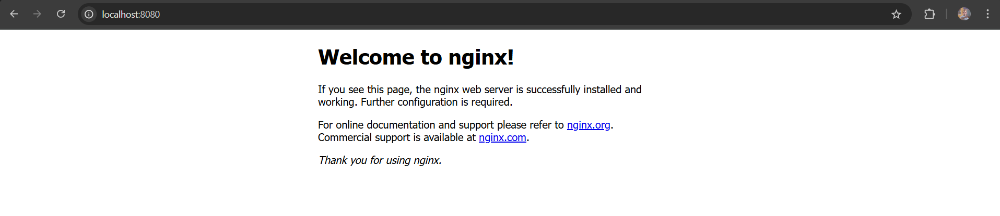

# Helm Chart Tutorial - Mein erstes Helm Chart

## Überblick

Dieses Tutorial führt durch die grundlegenden Helm-Operationen: Chart erstellen, installieren, aktualisieren und deinstallieren. Es verwendet ein einfaches Nginx-Deployment als Beispiel.

## Lernziele

- Verstehen der grundlegenden Helm-Konzepte (Chart, Release)
- Erlernen der wichtigsten Helm CLI-Befehle
- Praktische Erfahrung mit dem Helm-Workflow
- Verständnis der Helm Chart-Struktur

## Voraussetzungen

- Docker Desktop mit aktiviertem Kubernetes
- kubectl installiert und konfiguriert
- Helm CLI installiert

### Installation überprüfen

```bash
# Helm Version prüfen
helm version

# Kubernetes Cluster Status prüfen
kubectl get nodes
```

## Schritt-für-Schritt Anleitung

### 1. Neues Helm Chart erstellen

```bash
# Neues Chart mit Standardtemplate erstellen
helm create my-first-helm-chart
```

### 2. Chart-Struktur erkunden

Das erstellte Chart enthält folgende wichtige Dateien:

```
my-first-helm-chart/
├── Chart.yaml          # Chart-Metadaten
├── values.yaml         # Standardkonfiguration
├── templates/          # Kubernetes YAML-Templates
│   ├── deployment.yaml
│   ├── service.yaml
│   ├── ingress.yaml
│   └── ...
└── .helmignore         # Dateien die von Helm ignoriert werden
```

### 3. Chart als Release installieren

```bash
# Chart installieren
helm install my-nginx-release my-first-helm-chart/
```

### 4. Release-Status überprüfen

```bash
# Alle Helm Releases anzeigen
helm list

# Kubernetes-Objekte anzeigen
kubectl get all
kubectl get pods
kubectl get deployment
```


*Chart erfolgreich installiert mit einem Pod*

### 5. Auf die Anwendung zugreifen

```bash
# Port-Forward einrichten
kubectl port-forward service/my-nginx-release-my-first-helm-chart 8080:80
```

Öffnen Sie http://localhost:8080 im Browser:


*Nginx läuft erfolgreich*

### 6. Chart konfigurieren und aktualisieren

Editieren Sie `my-first-helm-chart/values.yaml`:

```yaml
# Anzahl der Replikas erhöhen
replicaCount: 3
```

Release aktualisieren:

```bash
# Upgrade durchführen
helm upgrade my-nginx-release my-first-helm-chart/
```

Nach dem Upgrade sollten 3 Pods laufen:

```bash
kubectl get pods
kubectl get deployment
```

### 7. Release deinstallieren

```bash
# Release und alle Kubernetes-Objekte entfernen
helm uninstall my-nginx-release
```


*Release erfolgreich deinstalliert*

### 8. Deinstallation verifizieren

```bash
# Release sollte nicht mehr gelistet sein
helm list

# Kubernetes-Objekte sollten gelöscht sein
kubectl get all -l app.kubernetes.io/instance=my-nginx-release
```

## Wichtige Helm-Befehle

| Befehl | Beschreibung |
|--------|--------------|
| `helm create <name>` | Neues Chart erstellen |
| `helm install <release-name> <chart>` | Chart installieren |
| `helm list` | Alle Releases anzeigen |
| `helm upgrade <release-name> <chart>` | Release aktualisieren |
| `helm uninstall <release-name>` | Release deinstallieren |
| `helm status <release-name>` | Release-Status anzeigen |

## Chart-Struktur verstehen

### Chart.yaml
Enthält Metadaten über das Chart (Name, Version, Beschreibung).

### values.yaml
Definiert Standardwerte für Template-Variablen. Diese können beim Install/Upgrade überschrieben werden.

### templates/
Enthält Kubernetes YAML-Templates mit Go-Template-Syntax. Variablen werden aus `values.yaml` eingefügt.

Beispiel aus `templates/deployment.yaml`:
```yaml
replicas: {{ .Values.replicaCount }}
image: "{{ .Values.image.repository }}:{{ .Values.image.tag }}"
```

## Alternative Zugriffsmethoden

### NodePort Service

Für externen Zugriff ohne Port-Forward, editieren Sie `templates/service.yaml`:

```yaml
spec:
  type: NodePort  # statt ClusterIP
```

Dann Upgrade durchführen:
```bash
helm upgrade my-nginx-release my-first-helm-chart/
kubectl get service  # NodePort finden
```

## Troubleshooting

### Häufige Probleme

1. **"connection refused"**: Kubernetes Cluster läuft nicht
   ```bash
   kubectl get nodes
   ```

2. **"release not found"**: Falscher Release-Name
   ```bash
   helm list
   ```

3. **Port bereits belegt**: Anderen Port für Port-Forward verwenden
   ```bash
   kubectl port-forward service/my-nginx-release-my-first-helm-chart 8081:80
   ```

## Weiterführende Themen

- Helm Values überschreiben mit `--set` oder `-f values-file.yaml`
- Chart Dependencies mit `dependencies:` in Chart.yaml
- Helm Hooks für erweiterte Deployment-Logik
- Chart Testing mit `helm test`
- Chart Repositories und `helm repo`

## Fazit

Diese Übung demonstriert den grundlegenden Helm-Workflow. Helm vereinfacht das Management komplexer Kubernetes-Anwendungen durch:

- **Templating**: Wiederverwendbare Konfigurationen
- **Releases**: Versionierte Deployments
- **Rollbacks**: Einfache Rückkehr zu vorherigen Versionen
- **Dependency Management**: Verwaltung von Chart-Abhängigkeiten