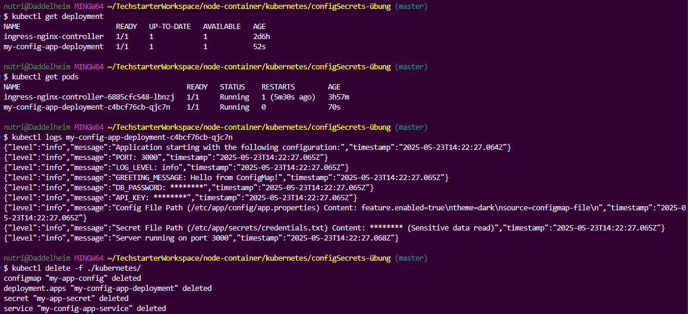

# Kubernetes ConfigMaps and Secrets Exercise

## Ziel

Aufbauend auf den Kubernetes-Grundlagen (Pods, Deployments, Services) und den Prinzipien der externen Konfiguration wird in dieser Übung gelernt, wie nicht-sensible und sensible Anwendungsdaten sicher in Kubernetes gespeichert und für Pods bereitgestellt werden. Ziel ist es, die Konzepte von ConfigMaps und Secrets praktisch anzuwenden, indem eine einfache Anwendung in Kubernetes deployt wird, die ihre Konfiguration (nicht-sensibel und sensibel) von diesen Objekten bezieht und dies per Logging verifiziert.

## Lernziele dieser Aufgabe

- Verstehen, warum Konfiguration und sensible Daten getrennt vom Container-Image gespeichert werden sollten (Recap 12-Factor Faktor III).
- Eine ConfigMap-Definition in YAML schreiben und verstehen.
- Eine Secret-Definition in YAML schreiben und verstehen.
- Lernen, wie man eine Anwendung (hier: in einem Deployment) konfiguriert, indem Werte aus ConfigMaps und Secrets als Umgebungsvariablen oder gemountete Dateien bereitgestellt werden.
- Verifizieren, dass die Anwendung die Konfiguration korrekt von ConfigMaps/Secrets bezieht.
- Best Practices im Umgang mit ConfigMaps und Secrets (insbesondere Sicherheit) verstehen.

## Anleitung

### 1. Voraussetzungen prüfen & Lokales Cluster starten

- Stelle sicher, dass Docker installiert und läuft.
- Stelle sicher, dass dein lokales Kubernetes Cluster (Docker Desktop Kubernetes, Minikube oder Kind) läuft und `kubectl` darauf zugreift (`kubectl get nodes`).
- Stelle sicher, dass du bei Docker Hub angemeldet bist (`docker login`) oder eine andere Registry nutzt, von der dein Image gezogen werden kann.

### 2. Vorbereitung: Einfache Node.js App mit Konfigurations-Logging

Das Projekt enthält eine einfache Node.js/Express Anwendung im `backend/` Verzeichnis, die folgende Kriterien erfüllt:

- Sie lauscht auf einem Port, der über die Umgebungsvariable `PORT` (z.B. `process.env.PORT`) konfiguriert wird.
- Sie erwartet und liest weitere Konfigurationswerte von Umgebungsvariablen und/oder aus Dateien in bestimmten Pfaden.
- Beim Start loggt die Anwendung (mit Winston) die Konfigurationswerte, die sie gelesen hat, einschließlich der Werte, die sie später von ConfigMaps und Secrets erhalten soll. **Wichtig**: Sensible Werte (z.B. Passwörter) werden dabei nicht im Klartext geloggt, sondern nur als Platzhalter!

**Beispiele für Konfigurationswerte in der App:**

- **Nicht-sensibel**: Ein String wie `GREETING_MESSAGE`, eine Log-Level-Variable `LOG_LEVEL`, oder der Inhalt einer simulierten Konfigurationsdatei (`/etc/app/config/app.properties`).
- **Sensibel**: Ein simuliertes Datenbank-Passwort `DB_PASSWORD`, ein API-Schlüssel `API_KEY`, oder der Inhalt einer simulierten Secret-Datei (`/etc/app/secrets/credentials.txt`).

Ein `Dockerfile` für diese Node.js App ist im `backend/` Verzeichnis vorhanden.

**Image bauen und pushen:**
Ersetze `your-dockerhub-username` mit deinem Docker Hub Benutzernamen oder deiner Registry.

```bash
cd backend
docker build -t your-dockerhub-username/my-config-app:latest .
docker push your-dockerhub-username/my-config-app:latest
```

### 3. Kubernetes Manifeste erstellen (YAML)

Im `kubernetes/` Ordner befinden sich die folgenden YAML-Dateien:

- **`app-configmap.yaml`**:
  - Definiert eine `ConfigMap` namens `my-app-config`.
  - Enthält nicht-sensible Schlüssel-Wert-Paare (z.B. `GREETING_MESSAGE: "Hello from ConfigMap!"`) und einen Schlüssel, dessen Wert den Inhalt einer Datei darstellt (`app.properties`).
- **`app-secret.yaml`**:
  - Definiert ein `Secret` namens `my-app-secret`.
  - Nutzt `stringData` um sensible Schlüssel-Wert-Paare (z.B. `DB_PASSWORD`, `API_KEY`) und den Inhalt einer Datei (`credentials.txt`) im Klartext einzugeben. Kubernetes kodiert diese dann.
  - **Wichtig**: Diese Datei (`app-secret.yaml`) ist in der `.gitignore` eingetragen, um zu verhindern, dass sie mit `stringData` in ein öffentliches Git-Repository eingecheckt wird.
- **`app-deployment.yaml`**:
  - Definiert ein `Deployment` für die App.
  - Setzt `replicas: 1`.
  - Verwendet das gepushte Docker Image (`your-dockerhub-username/my-config-app:latest` - **stelle sicher, dies angepasst zu haben!**).
  - Konfiguriert Umgebungsvariablen über `valueFrom.configMapKeyRef` und `valueFrom.secretKeyRef`.
  - Mountet Konfigurationsdateien aus der ConfigMap und dem Secret über `volumes` und `volumeMounts` in die Pfade `/etc/app/config/` und `/etc/app/secrets/`.
- **`app-service.yaml`**:
  - Definiert einen `Service` vom Typ `NodePort` (für einfachen externen Zugriff) für das Deployment.
  - Selektiert die App-Pods und leitet Anfragen an den `targetPort` der Anwendung weiter.

### 4. Ressourcen in Kubernetes deployen

Navigiere im Terminal zum `kubernetes/` Verzeichnis.

**Sicherheitshinweis**: Deploye zuerst die ConfigMap und das Secret!

```bash
kubectl apply -f app-configmap.yaml
kubectl apply -f app-secret.yaml
```

Überprüfe, ob sie erstellt wurden:

```bash
kubectl get configmaps
kubectl get secrets
```

Deploye das Deployment und den Service:

```bash
kubectl apply -f app-deployment.yaml
kubectl apply -f app-service.yaml
```

### 5. Verifizieren der Konfigurationsübergabe

Überprüfe den Status deines Deployments und Pods:

```bash
kubectl get deployment -l app=my-config-app
kubectl get pods -l app=my-config-app
```

Warte, bis der/die Pod(s) `Running` sind.

Sieh dir die Logs des Pods an (ersetze `<pod-name>` mit dem Namen deines Pods):

```bash
kubectl logs <pod-name>
```

Überprüfe die Log-Ausgabe deiner Anwendung, um zu sehen, ob sie die Konfigurationswerte (inklusive der von ConfigMap und Secret) korrekt gelesen und geloggt hat. Stelle sicher, dass das Passwort/Secret nicht im Klartext geloggt wurde.

**Beispielhafte Log-Ausgabe und Pod-Status:**
(Hier wird das Bild `logs.png` eingebunden, das sich im Root-Verzeichnis des Projekts befinden sollte.)



(Optional): Überprüfe die detaillierte Konfiguration des Pods:

```bash
kubectl describe pod <pod-name>
```

Suche nach den Abschnitten `Environment` und `Mounts`, um zu sehen, wie die ConfigMaps und Secrets konfiguriert wurden.

### 6. Aufräumen

Lösche alle erstellten Ressourcen:

```bash
kubectl delete -f app-deployment.yaml -f app-service.yaml -f app-configmap.yaml -f app-secret.yaml
# Alternativ, wenn alle Ressourcen das Label app=my-config-app haben (was hier der Fall sein sollte für Deployment und Service):
# kubectl delete deployment,service,configmap,secret -l app=my-config-app
# Beachte, dass ConfigMap und Secret in diesem Beispiel kein Label app=my-config-app haben, daher ist die erste Variante sicherer.
```

Überprüfe die Löschung:

```bash
kubectl get deployment,service,configmaps,secrets -l app=my-config-app
kubectl get configmap my-app-config
kubectl get secret my-app-secret
```

Sollte "No resources found" für die gelabelten Ressourcen und die direkt benannten ConfigMap/Secret ausgeben.

---

Dieses Projekt dient als praktische Übung zum Verständnis und zur Anwendung von ConfigMaps und Secrets in Kubernetes.

---

## Reflexionsfragen

**Datum:** 2024-07-29

**1. Warum ist es eine Best Practice, Konfiguration und sensible Daten in Kubernetes getrennt von den Docker Images zu speichern? (Denke an die 12-Factor App).**

Es ist eine Best Practice, Konfiguration und sensible Daten getrennt von Docker Images zu speichern, weil dies mehrere Vorteile gemäß den Prinzipien der [12-Factor App](https://12factor.net/config) bietet:

- **Flexibilität und Portabilität:** Ein Image kann in verschiedenen Umgebungen (Entwicklung, Staging, Produktion) ohne Änderungen verwendet werden, indem die Konfiguration extern bereitgestellt wird.
- **Sicherheit:** Sensible Daten wie Passwörter oder API-Keys sind nicht im Image hardcodiert. Dies reduziert das Risiko, dass sie bei der Weitergabe des Images oder durch Zugriff auf das Image-Repository kompromittiert werden.
- **Wartbarkeit:** Konfigurationsänderungen erfordern kein erneutes Bauen und Verteilen des Images. Dies beschleunigt Deployments und vereinfacht das Management.
- **Skalierbarkeit:** Verschiedene Instanzen einer Anwendung können unterschiedliche Konfigurationen verwenden, ohne dass separate Images benötigt werden.

**2. Was ist der Hauptunterschied im Zweck zwischen einer ConfigMap und einem Secret?**

Der Hauptunterschied liegt in der Art der Daten, die sie speichern sollen:

- **ConfigMap:** Dient zur Speicherung von nicht-sensiblen Konfigurationsdaten als Schlüssel-Wert-Paare oder als Inhalt ganzer Konfigurationsdateien. Diese Daten sind für die Anwendungskonfiguration gedacht, die keine besondere Geheimhaltung erfordert (z.B. Log-Level, Feature-Flags, Endpunkte).
- **Secret:** Dient zur Speicherung von sensiblen Daten wie Passwörtern, API-Schlüsseln, TLS-Zertifikaten oder Tokens. Kubernetes behandelt Secrets mit zusätzlichen Sicherheitsmaßnahmen, wie z.B. der Möglichkeit, sie verschlüsselt at-rest zu speichern (abhängig von der Cluster-Konfiguration) und den Zugriff darauf stärker zu kontrollieren. Die Daten in Secrets werden standardmäßig base64-kodiert, was aber keine Verschlüsselung darstellt, sondern lediglich eine Kodierung ist.

**3. Beschreibe die zwei Hauptarten, wie du Konfiguration (sowohl aus ConfigMaps als auch Secrets) für einen Container in einem Pod bereitstellen kannst (Nenne die YAML-Konfiguration im Pod/Deployment Spec).**

Die zwei Hauptarten sind:

- **Als Umgebungsvariablen (Environment Variables):**

  - Einzelne Schlüssel-Wert-Paare aus einer ConfigMap oder einem Secret können als Umgebungsvariablen in den Container injiziert werden.
  - YAML-Konfiguration im `spec.template.spec.containers.env` eines Deployments/Pods:
    ```yaml
    env:
      - name: MY_VARIABLE_FROM_CONFIGMAP
        valueFrom:
          configMapKeyRef:
            name: my-app-config # Name der ConfigMap
            key: some-key # Schlüssel in der ConfigMap
      - name: MY_SECRET_VARIABLE
        valueFrom:
          secretKeyRef:
            name: my-app-secret # Name des Secrets
            key: some-secret-key # Schlüssel im Secret
    ```
  - Man kann auch alle Schlüssel-Wert-Paare einer ConfigMap oder eines Secrets als Umgebungsvariablen laden mittels `envFrom` und `configMapRef` bzw. `secretRef`.

- **Als gemountete Dateien (Volume Mounts):**
  - Der Inhalt einer ConfigMap oder eines Secrets (oder spezifische Schlüssel daraus) kann als Dateien in ein Volume gemountet werden, das dann im Dateisystem des Containers verfügbar ist.
  - YAML-Konfiguration im `spec.template.spec`:
    ```yaml
    spec:
      containers:
        - name: my-container
          # ... andere Container-Definitionen ...
          volumeMounts:
            - name: config-volume
              mountPath: /etc/app/config # Pfad im Container
            - name: secret-volume
              mountPath: /etc/app/secrets
      volumes:
        - name: config-volume
          configMap:
            name: my-app-config # Name der ConfigMap
            # Optional: items, um spezifische Schlüssel als Dateien zu mounten
            # items:
            # - key: app.properties
            #   path: my-app.properties
        - name: secret-volume
          secret:
            secretName: my-app-secret # Name des Secrets
            # Optional: items
    ```

**4. Welchen Weg (ENV Var oder gemountete Datei) würdest du für ein kritisches Datenbank-Passwort in Produktion bevorzugen und warum?**

Für ein kritisches Datenbank-Passwort in Produktion würde ich **gemountete Dateien** bevorzugen. Gründe dafür sind:

- **Sicherheit:** Umgebungsvariablen können leichter versehentlich geloggt werden (z.B. durch Debug-Ausgaben, `printenv` oder in Crash-Dumps). Gemountete Dateien sind weniger anfällig für solche Leaks, da die Anwendung sie explizit lesen muss.
- **Aktualisierung:** Wenn ein Secret als Volume gemountet wird, können Aktualisierungen des Secrets (z.B. bei Passwortrotation) automatisch im gemounteten Volume reflektiert werden (mit einer gewissen Verzögerung, `kubelet` prüft periodisch). Die Anwendung kann dann so gestaltet werden, dass sie die Datei periodisch neu liest. Bei Umgebungsvariablen ist eine Aktualisierung ohne Neustart des Pods nicht möglich.
- **Granularität und Kontrolle:** Dateiberechtigungen auf dem gemounteten Volume können (theoretisch, je nach Kubernetes-Version und Konfiguration) feiner gesteuert werden.
- **Best Practice:** Viele Sicherheitsrichtlinien und -empfehlungen tendieren dazu, sensible Daten eher über Dateien als über Umgebungsvariablen bereitzustellen, um die Angriffsfläche zu minimieren.

**5. Deine Secret YAML Datei sollte nicht in einem öffentlichen Git-Repository eingecheckt werden. Warum ist das Feld `stringData:` in der Secret-Definition zwar praktisch, aber auch ein Grund für diese Vorsicht?**

Das Feld `stringData:` in einer Secret-Definition ist praktisch, weil es erlaubt, sensible Daten direkt im Klartext in die YAML-Datei zu schreiben, ohne sie vorher manuell base64-kodieren zu müssen. Kubernetes übernimmt die Base64-Kodierung dann automatisch beim Erstellen des Secrets.

Genau diese Bequemlichkeit ist aber auch der Grund für die erhöhte Vorsicht:

- **Klartext-Exposition:** Wenn eine YAML-Datei mit `stringData:` und tatsächlichen Geheimnissen (Passwörtern, API-Keys etc.) in ein Git-Repository eingecheckt wird – insbesondere in ein öffentliches –, werden diese Geheimnisse im Klartext in der Versionshistorie gespeichert. Jeder, der Zugriff auf das Repository hat (oder hatte), kann diese Geheimnisse einsehen.
- **Base64 ist keine Verschlüsselung:** Selbst wenn man `data` verwendet und die Werte manuell base64-kodiert, ist dies keine Sicherheitsmaßnahme. Base64 ist eine Kodierung, keine Verschlüsselung, und kann trivial dekodiert werden. Das Hauptproblem bei `stringData` ist jedoch, dass die Werte direkt lesbar sind, ohne diesen zusätzlichen (wenn auch trivialen) Schritt.

Daher ist es essentiell, Secret-YAML-Dateien, die `stringData` mit echten Geheimnissen enthalten, aus der Versionskontrolle (z.B. via `.gitignore`) auszuschließen und stattdessen alternative Methoden für das Management von Secrets in GitOps-Workflows zu verwenden (z.B. verschlüsselte Secrets mit Tools wie Sealed Secrets, HashiCorp Vault Integration, SOPS etc.). Für lokale Entwicklung oder Testzwecke mag `stringData` akzeptabel sein, solange die Dateien nicht committet werden.
