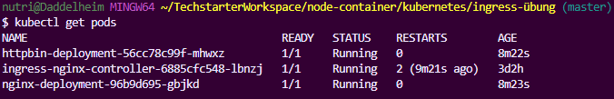
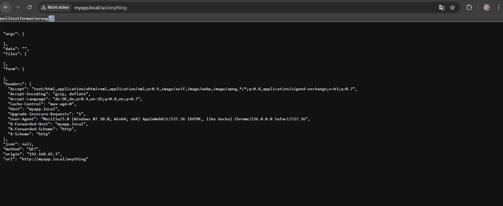

# Kubernetes Ingress Übung: Hostnamen-basiertes Routing

## Ziel der Übung

In dieser Übung konfigurieren wir Kubernetes so, dass es Anfragen an unsere Webanwendungen basierend auf dem eingegebenen Hostnamen (z.B. `myapp.local`) und dem Pfad (z.B. `/` oder `/api`) an verschiedene Dienste weiterleitet. Wir werden lernen, wie man eine "Ingress-Ressource" erstellt und die lokale `hosts`-Datei anpasst, um dies zu testen.

**Was ist ein Ingress?**
Stell dir einen Ingress wie einen intelligenten Türsteher für deinen Kubernetes-Cluster vor. Er empfängt Anfragen von außerhalb des Clusters und leitet sie basierend auf Regeln, die du definierst, an die richtigen internen Dienste (deine Anwendungen) weiter.

## Lernziele

- Verstehen, wie Ingress Regeln basierend auf Hostnamen definiert.
- Lernen, wie man die lokale `hosts`-Datei modifiziert, um einen eigenen Hostnamen (wie `myapp.local`) auf eine IP-Adresse aufzulösen.
- Verstehen, wie Ingress den Datenverkehr basierend auf einer Kombination aus Hostname und Pfad weiterleitet.
- Die Funktion des Hostnamen-basierten Routings praktisch testen.

## Voraussetzungen

1.  **Docker:** Muss installiert sein und laufen.
2.  **Lokales Kubernetes Cluster:** Ein laufendes Kubernetes Cluster (z.B. über Docker Desktop, Minikube oder Kind). Du solltest mit `kubectl get nodes` überprüfen können, ob es erreichbar ist.
3.  **Ingress Controller:** Ein Ingress Controller (wie NGINX Ingress) muss im Cluster installiert sein. Für diese Übung gehen wir davon aus, dass dieser bereits läuft. Der Ingress Controller ist die Software, die die Ingress-Regeln tatsächlich umsetzt.

## Schritte zur Durchführung

### 1. Anwendungsdienste (Target Services) bereitstellen

Zuerst benötigen wir einige Beispielanwendungen, zu denen wir den Verkehr leiten können. Wir verwenden zwei einfache Webanwendungen:

- **Nginx:** Ein einfacher Webserver.
- **HTTPBin:** Ein Dienst, der Anfragedaten zurückgibt und nützlich zum Testen ist.

Diese werden als "Deployments" (die unsere Anwendungen ausführen) und "Services" (die einen festen Ansprechpunkt innerhalb des Clusters für unsere Anwendungen bereitstellen) in Kubernetes erstellt.

Die Konfigurationsdateien hierfür sind:

- `nginx-deployment.yaml` & `nginx-service.yaml`
- `httpbin-deployment.yaml` & `httpbin-service.yaml`

Diese werden mit `kubectl apply -f <dateiname>.yaml` angewendet.

### 2. Ingress-Ressource definieren

Jetzt erstellen wir die eigentliche Ingress-Regel in einer Datei namens `ingress.yaml`.

**`ingress.yaml` Inhalt:**

```yaml
apiVersion: networking.k8s.io/v1
kind: Ingress
metadata:
  name: app-hostname-ingress
  annotations:
    nginx.ingress.kubernetes.io/rewrite-target: /$2 # Wichtig für den /api Pfad!
spec:
  ingressClassName: nginx # Gibt an, welcher Ingress Controller verwendet wird
  rules:
    - host: "myapp.local" # Wir reagieren nur auf Anfragen an diesen Hostnamen
      http:
        paths:
          - path: / # Anfragen an myapp.local/
            pathType: Prefix
            backend:
              service:
                name: nginx-service # ...gehen an den Nginx Service
                port:
                  number: 80
          - path: /api(/|$)(.*) # Anfragen an myapp.local/api/...
            pathType: ImplementationSpecific # Erlaubt komplexere Pfadmuster
            backend:
              service:
                name: httpbin-service # ...gehen an den HTTPBin Service
                port:
                  number: 80
```

**Wichtige Punkte in `ingress.yaml`:**

- `host: "myapp.local"`: Der Ingress reagiert nur, wenn die Anfrage für `myapp.local` bestimmt ist.
- `path: /`: Leitet Anfragen an `http://myapp.local/` zum `nginx-service`.
- `path: /api(/|$)(.*)`: Leitet Anfragen an `http://myapp.local/api/...` zum `httpbin-service`.
  - `nginx.ingress.kubernetes.io/rewrite-target: /$2`: Diese spezielle Anweisung (Annotation) ist wichtig. Sie sorgt dafür, dass der `/api`-Teil vom Pfad entfernt wird, bevor die Anfrage an den `httpbin-service` geht. HTTPBin erwartet z.B. `/anything`, nicht `/api/anything`. `$2` bezieht sich auf den Teil des Pfades, der in der Klammer `(.*)` im `path` gefangen wird.
- `pathType: ImplementationSpecific`: Wird verwendet, da unser `/api`-Pfad einen regulären Ausdruck enthält.

### 3. Ingress-Ressource anwenden

Speichere den Inhalt in `ingress.yaml` und wende sie im Terminal an:

```bash
kubectl apply -f ingress.yaml
```

### 4. Ingress-Setup überprüfen & IP-Adresse ermitteln

Überprüfe, ob der Ingress korrekt erstellt wurde und eine IP-Adresse bekommen hat:

```bash
kubectl get ingress
```

Notiere dir die IP-Adresse unter der Spalte `ADDRESS`. Bei lokalen Clustern wie Docker Desktop ist dies oft `localhost` oder `127.0.0.1`.

Du kannst auch den Status deiner laufenden Anwendungen (Pods) überprüfen:

```bash
kubectl get pods
```

Hier ist ein Beispiel, wie die Ausgabe aussehen könnte (deine Pod-Namen werden anders sein):



### 5. Lokale Hosts-Datei anpassen

Damit dein Computer weiß, dass `myapp.local` auf die IP-Adresse deines Ingress Controllers zeigen soll, musst du die `hosts`-Datei deines Betriebssystems bearbeiten.

- **Windows:** `C:\Windows\System32\drivers\etc\hosts` (Editor als Administrator öffnen)
- **Linux/macOS:** `/etc/hosts` (Editor mit `sudo` öffnen)

Füge folgende Zeile hinzu (ersetze `<Cluster-IP>` mit der IP-Adresse aus Schritt 4):

```
<Cluster-IP> myapp.local
```

Beispiel: Wenn die IP `127.0.0.1` ist, dann `127.0.0.1 myapp.local`.

Speichere die Datei. Es kann sein, dass du deinen DNS-Cache leeren musst:

- **Windows:** `ipconfig /flushdns` in der Eingabeaufforderung (als Administrator).

### 6. Zugriff mit Hostnamen testen

Öffne nun deinen Webbrowser und teste die folgenden Adressen:

1.  **`http://myapp.local/`**
    Du solltest die Willkommensseite von Nginx sehen:

    

2.  **`http://myapp.local/api/anything`** (oder z.B. `http://myapp.local/api/get`)
    Du solltest eine JSON-Antwort vom HTTPBin-Dienst sehen, die Details zu deiner Anfrage enthält. Der `url`-Eintrag in der JSON-Antwort sollte den Pfad ohne `/api` zeigen (z.B. `... "url": "http://myapp.local/anything" ...`), was bestätigt, dass das `rewrite-target` funktioniert hat.

    

Wenn du diese Ergebnisse siehst, hast du erfolgreich Hostnamen-basiertes Routing mit Pfad-Umschreibung in Kubernetes konfiguriert!

## Reflexionsfragen (26. Mai 2025)

**1. Warum ist es notwendig, die lokale Hosts-Datei anzupassen, um das Hostnamen-basierte Routing mit Ingress in deinem lokalen Cluster zu testen?**

Dein Computer und das Internet verwenden normalerweise das Domain Name System (DNS), um Hostnamen wie `www.google.com` in IP-Adressen umzuwandeln, die Computer verstehen. Für einen lokalen, selbstdefinierten Hostnamen wie `myapp.local` gibt es keinen öffentlichen DNS-Eintrag. Die `hosts`-Datei ist eine lokale Datei auf deinem Computer, die es dir erlaubt, solche Zuordnungen manuell vorzunehmen. Indem du `myapp.local` in der `hosts`-Datei der IP-Adresse deines Ingress Controllers (dem "Türsteher" deines Kubernetes Clusters) zuweist, sagst du deinem Browser: "Wenn ich `myapp.local` eingebe, sende die Anfrage bitte an diese spezifische IP-Adresse." Ohne diesen Eintrag wüsste dein Browser nicht, wohin er die Anfrage für `myapp.local` schicken soll.

**2. Wie hat die Ingress Resource (`ingress.yaml`) gesteuert, welcher Service (Nginx oder HTTPBin) eine Anfrage erhält, wenn der Browser `http://myapp.local/` oder `http://myapp.local/api/anything` aufruft? (Nenne die relevanten Felder in der YAML und wie sie zusammenarbeiten).**

Die Steuerung erfolgt durch die `rules` (Regeln) in der `ingress.yaml`:

*   **`host: "myapp.local"`**: Diese Zeile legt fest, dass die folgenden Regeln nur für Anfragen gelten, die an den Hostnamen `myapp.local` gerichtet sind.
*   Innerhalb dieses Hosts gibt es `http.paths` (Pfade):
    *   Für `http://myapp.local/`:
        *   `path: /`: Diese Regel passt auf Anfragen, deren Pfad mit `/` beginnt (also der Hauptpfad).
        *   `pathType: Prefix`: Bestätigt, dass es sich um einen Präfix-Abgleich handelt.
        *   `backend.service.name: nginx-service`: Leitet diese Anfragen an den Kubernetes Service namens `nginx-service` weiter.
    *   Für `http://myapp.local/api/anything`:
        *   `path: /api(/|$)(.*)`: Diese Regel passt auf Anfragen, deren Pfad mit `/api` beginnt. Der Teil `(/|$)(.*)` ist ein regulärer Ausdruck, der hilft, den Rest des Pfades zu erfassen (z.B. `/anything`).
        *   `pathType: ImplementationSpecific`: Ist notwendig, weil wir einen regulären Ausdruck im Pfad verwenden.
        *   `backend.service.name: httpbin-service`: Leitet diese Anfragen an den Kubernetes Service namens `httpbin-service` weiter.
    *   Zusätzlich spielt die Annotation `nginx.ingress.kubernetes.io/rewrite-target: /$2` eine Rolle für den `/api`-Pfad. Sie sorgt dafür, dass der `/api`-Teil vom Pfad entfernt wird, bevor die Anfrage an `httpbin-service` geht, da dieser Service den Pfad ohne `/api` erwartet.

Zusammenfassend: Der Ingress Controller schaut sich den Hostnamen und den Pfad der eingehenden Anfrage an und vergleicht sie mit den definierten Regeln. Trifft eine Regel zu, wird die Anfrage an den dahinter konfigurierten Service weitergeleitet.

**3. Was passiert mit einer Anfrage an `http://andererhost.local/` oder an `http://<Cluster-IP>/some/path/`, wenn diese nicht in deinen Ingress-Regeln für `myapp.local` definiert sind (und kein Default Backend existiert)?**

Wenn eine Anfrage an den Ingress Controller kommt, die:
*   einen Hostnamen verwendet, der in keiner `host`-Regel definiert ist (z.B. `http://andererhost.local/`), oder
*   direkt an die IP-Adresse des Ingress Controllers geht (`http://<Cluster-IP>/some/path/`) und kein Hostname in der Anfrage spezifiziert ist, der einer Regel entspricht,
und **kein `defaultBackend`** (eine Art "Auffangregel" für nicht passende Anfragen) im Ingress definiert ist, wird der Ingress Controller die Anfrage typischerweise mit einem HTTP-Fehlercode beantworten. Meistens ist das ein **404 Not Found**. Der Ingress Controller findet keine passende Regel, um die Anfrage weiterzuleiten, und signalisiert daher, dass die angeforderte Ressource nicht gefunden wurde.

**4. Welche Vorteile bietet das Routing basierend auf Hostnamen und Pfaden mit Ingress, verglichen mit der Nutzung von NodePorts oder separaten LoadBalancern für jeden Service, besonders wenn du viele Services hast?**

Ingress bietet mehrere wichtige Vorteile, besonders bei vielen Diensten:

*   **Eine einzige Eintrittsstelle (IP-Adresse):** Statt für jeden Dienst einen eigenen `NodePort` (eine spezifische Portnummer auf jedem deiner Kubernetes-Knoten) oder einen eigenen, oft teuren, externen `LoadBalancer` (ein Gerät oder Dienst, der Anfragen auf mehrere Server verteilt) zu benötigen, bündelt Ingress den gesamten externen Verkehr über eine einzige IP-Adresse (die des Ingress Controllers). Das spart Ressourcen und vereinfacht die Netzwerkkonfiguration.
*   **Kostenersparnis:** Externe LoadBalancer können, besonders in Cloud-Umgebungen, Kosten verursachen. Mit Ingress benötigst du in der Regel nur einen LoadBalancer für den Ingress Controller selbst, und dieser kann dann den Verkehr zu vielen verschiedenen Diensten leiten.
*   **Zentralisierte Konfiguration:** Routing-Regeln (welcher Host/Pfad zu welchem Dienst führt) werden zentral in Ingress-Ressourcen definiert. Das macht die Verwaltung übersichtlicher, als wenn man sich um viele einzelne NodePorts oder LoadBalancer-Konfigurationen kümmern müsste.
*   **Flexibles Routing:** Ingress erlaubt komplexes Routing basierend auf Hostnamen (z.B. `api.meinefirma.de`, `shop.meinefirma.de`) und Pfaden (z.B. `/produkte`, `/benutzer`). Dies ermöglicht es, verschiedene Anwendungen oder Versionen von Anwendungen unter derselben IP-Adresse, aber unterschiedlichen "Webadressen" zu betreiben.
*   **SSL/TLS-Terminierung:** Ingress Controller können sich um die Verschlüsselung (HTTPS) kümmern. Du kannst SSL/TLS-Zertifikate zentral am Ingress Controller konfigurieren, anstatt dies für jeden einzelnen Dienst tun zu müssen.

Stell dir vor, du hast 20 verschiedene Webanwendungen. Mit NodePorts müsstest du dir 20 verschiedene Portnummern merken und verwalten. Mit separaten LoadBalancern hättest du 20 LoadBalancer und potenziell 20 öffentliche IP-Adressen. Mit Ingress hast du eine IP-Adresse und definierst einfach 20 Regeln, die den Verkehr intelligent verteilen. Das ist deutlich effizienter und einfacher zu handhaben.