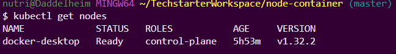

# Kubernetes Einführung - Reflexion

## Cluster-Setup

**Welche Methode hast du zum Aufsetzen deines lokalen Kubernetes Clusters gewählt (Docker Desktop, Minikube, Kind) und warum?**

Ich habe Docker Desktop verwendet, um meinen lokalen Kubernetes-Cluster aufzusetzen. Der Hauptgrund dafür ist die nahtlose Integration in meine bestehende Docker-Entwicklungsumgebung. Docker Desktop bietet eine einfache Möglichkeit, Kubernetes mit nur einem Klick zu aktivieren und zu verwalten, ohne dass zusätzliche Softwareinstallationen oder komplexe Konfigurationen erforderlich sind. Es ist sehr benutzerfreundlich und ideal für die lokale Entwicklung und das Testen von Kubernetes-Anwendungen.

## Control Plane

**Beschreibe in eigenen Worten, was die Control Plane eines Kubernetes Clusters ist und welche Kernrolle sie hat (ohne spezifische Komponenten wie etcd, Scheduler etc. im Detail zu nennen).**

Die Control Plane ist das "Gehirn" eines Kubernetes-Clusters. Sie ist dafür verantwortlich, den gesamten Cluster zu verwalten und sicherzustellen, dass er den gewünschten Zustand beibehält, den der Benutzer definiert hat. Ihre Kernrolle besteht darin, Entscheidungen über den Cluster zu treffen – zum Beispiel, wo Anwendungen (Pods) ausgeführt werden sollen, wie auf Ausfälle reagiert wird und wie Aktualisierungen gehandhabt werden. Sie überwacht kontinuierlich den Zustand des Clusters und ergreift Maßnahmen, um Abweichungen vom Soll-Zustand zu korrigieren.

## Worker Node

**Was ist die Rolle eines Worker Node in einem Kubernetes Cluster?**

Ein Worker Node ist eine Maschine (physisch oder virtuell) im Kubernetes-Cluster, auf der die eigentlichen Anwendungen (in Form von Pods und deren Containern) ausgeführt werden. Worker Nodes stellen die notwendigen Ressourcen wie CPU, Arbeitsspeicher und Netzwerk zur Verfügung, die von den Anwendungen benötigt werden. Sie empfangen Anweisungen von der Control Plane und führen die zugewiesenen Aufgaben aus, wie das Starten, Stoppen und Überwachen von Containern.

## `kubectl` Interaktion

**Der Befehl `kubectl` ist das Kommandozeilen-Tool zur Interaktion mit Kubernetes. Mit welchem zentralen Bestandteil der Kubernetes Architektur spricht `kubectl` direkt, wenn du einen Befehl absetzt?**

Wenn ich einen `kubectl`-Befehl absetze, spricht `kubectl` direkt mit dem **API-Server** der Kubernetes Control Plane. Der API-Server ist die zentrale Schnittstelle, über die alle Interaktionen mit dem Cluster – sowohl von externen Benutzern als auch von internen Cluster-Komponenten – abgewickelt werden.

## Überprüfung der `kubectl`-Verbindung

**Wie hast du praktisch überprüft, dass `kubectl` erfolgreich eine Verbindung zu deinem lokalen Cluster herstellen konnte? Welche Befehle hast du dafür genutzt, und was hast du als erfolgreiche Ausgabe erwartet?**

Um zu überprüfen, ob `kubectl` erfolgreich eine Verbindung zu meinem lokalen Cluster herstellen konnte, habe ich folgende Befehle verwendet:

1.  **`kubectl cluster-info`**:

    - **Erwartete Ausgabe:** Informationen über die Adresse des Kubernetes Control Plane (Master) und der CoreDNS-Services. Eine erfolgreiche Ausgabe zeigt, dass `kubectl` den API-Server erreichen und grundlegende Cluster-Informationen abrufen kann.

    ```
    Kubernetes control plane is running at https://kubernetes.docker.internal:6443
    CoreDNS is running at https://kubernetes.docker.internal:6443/api/v1/namespaces/kube-system/services/kube-dns:dns/proxy
    ...
    ```

2.  **`kubectl get nodes`**:

    - **Erwartete Ausgabe:** Eine Liste der Nodes im Cluster mit ihrem Status (z.B. `Ready`). Für Docker Desktop ist dies typischerweise ein einzelner Node namens `docker-desktop`.

    ```
    NAME             STATUS   ROLES           AGE   VERSION
    docker-desktop   Ready    control-plane   20d   v1.29.2
    ```

3.  **`kubectl get pods -A` (oder `kubectl get pods --all-namespaces`)**:
    - **Erwartete Ausgabe:** Eine Liste aller Pods in allen Namespaces, einschließlich der System-Pods im `kube-system`-Namespace. Dies zeigt, dass der Cluster nicht nur erreichbar ist, sondern auch aktiv Systemkomponenten ausführt.

Diese Befehle und ihre erfolgreichen Ausgaben bestätigen, dass `kubectl` korrekt konfiguriert ist und mit dem API-Server meines lokalen Kubernetes-Clusters kommunizieren kann.

## Deklarative Philosophie

**Basierend auf dem Theorieteil: Erkläre kurz die Kernidee der deklarativen Philosophie von Kubernetes.**

Die Kernidee der deklarativen Philosophie von Kubernetes ist, dass man den **gewünschten Zustand** des Systems beschreibt (z.B. "Ich möchte, dass drei Instanzen meiner Webanwendung laufen"), anstatt eine Abfolge von imperativen Befehlen zu geben (z.B. "Starte Instanz 1, dann starte Instanz 2, dann starte Instanz 3").

Man deklariert also, _was_ man erreichen möchte, und überlässt es Kubernetes, herauszufinden, _wie_ dieser Zustand erreicht und aufrechterhalten wird. Kubernetes überwacht kontinuierlich den aktuellen Zustand und vergleicht ihn mit dem deklarierten Soll-Zustand. Bei Abweichungen ergreift Kubernetes automatisch die notwendigen Schritte (z.B. einen neuen Pod starten, wenn einer ausfällt), um den Soll-Zustand wiederherzustellen. Dies macht das System robuster, fehlertoleranter und einfacher zu verwalten, besonders bei komplexen Anwendungen und dynamischen Umgebungen.

## Screenshot des laufenden Clusters

Hier ist ein Screenshot, der die Ausgabe von `kubectl get nodes` und `kubectl get pods -n myapp` zeigt, um den laufenden Cluster und die bereitgestellte Anwendung zu demonstrieren:



````<!-- filepath: c:\Users\nutri\TechstarterWorkspace\node-container\kubernetes\k8s-intro-reflection.md -->
# Kubernetes Einführung - Reflexion

## Cluster-Setup

**Welche Methode hast du zum Aufsetzen deines lokalen Kubernetes Clusters gewählt (Docker Desktop, Minikube, Kind) und warum?**

Ich habe Docker Desktop verwendet, um meinen lokalen Kubernetes-Cluster aufzusetzen. Der Hauptgrund dafür ist die nahtlose Integration in meine bestehende Docker-Entwicklungsumgebung. Docker Desktop bietet eine einfache Möglichkeit, Kubernetes mit nur einem Klick zu aktivieren und zu verwalten, ohne dass zusätzliche Softwareinstallationen oder komplexe Konfigurationen erforderlich sind. Es ist sehr benutzerfreundlich und ideal für die lokale Entwicklung und das Testen von Kubernetes-Anwendungen.

## Control Plane

**Beschreibe in eigenen Worten, was die Control Plane eines Kubernetes Clusters ist und welche Kernrolle sie hat (ohne spezifische Komponenten wie etcd, Scheduler etc. im Detail zu nennen).**

Die Control Plane ist das "Gehirn" eines Kubernetes-Clusters. Sie ist dafür verantwortlich, den gesamten Cluster zu verwalten und sicherzustellen, dass er den gewünschten Zustand beibehält, den der Benutzer definiert hat. Ihre Kernrolle besteht darin, Entscheidungen über den Cluster zu treffen – zum Beispiel, wo Anwendungen (Pods) ausgeführt werden sollen, wie auf Ausfälle reagiert wird und wie Aktualisierungen gehandhabt werden. Sie überwacht kontinuierlich den Zustand des Clusters und ergreift Maßnahmen, um Abweichungen vom Soll-Zustand zu korrigieren.

## Worker Node

**Was ist die Rolle eines Worker Node in einem Kubernetes Cluster?**

Ein Worker Node ist eine Maschine (physisch oder virtuell) im Kubernetes-Cluster, auf der die eigentlichen Anwendungen (in Form von Pods und deren Containern) ausgeführt werden. Worker Nodes stellen die notwendigen Ressourcen wie CPU, Arbeitsspeicher und Netzwerk zur Verfügung, die von den Anwendungen benötigt werden. Sie empfangen Anweisungen von der Control Plane und führen die zugewiesenen Aufgaben aus, wie das Starten, Stoppen und Überwachen von Containern.

## `kubectl` Interaktion

**Der Befehl `kubectl` ist das Kommandozeilen-Tool zur Interaktion mit Kubernetes. Mit welchem zentralen Bestandteil der Kubernetes Architektur spricht `kubectl` direkt, wenn du einen Befehl absetzt?**

Wenn ich einen `kubectl`-Befehl absetze, spricht `kubectl` direkt mit dem **API-Server** der Kubernetes Control Plane. Der API-Server ist die zentrale Schnittstelle, über die alle Interaktionen mit dem Cluster – sowohl von externen Benutzern als auch von internen Cluster-Komponenten – abgewickelt werden.

## Überprüfung der `kubectl`-Verbindung

**Wie hast du praktisch überprüft, dass `kubectl` erfolgreich eine Verbindung zu deinem lokalen Cluster herstellen konnte? Welche Befehle hast du dafür genutzt, und was hast du als erfolgreiche Ausgabe erwartet?**

Um zu überprüfen, ob `kubectl` erfolgreich eine Verbindung zu meinem lokalen Cluster herstellen konnte, habe ich folgende Befehle verwendet:

1.  **`kubectl cluster-info`**:
    *   **Erwartete Ausgabe:** Informationen über die Adresse des Kubernetes Control Plane (Master) und der CoreDNS-Services. Eine erfolgreiche Ausgabe zeigt, dass `kubectl` den API-Server erreichen und grundlegende Cluster-Informationen abrufen kann.
    ```
    Kubernetes control plane is running at https://kubernetes.docker.internal:6443
    CoreDNS is running at https://kubernetes.docker.internal:6443/api/v1/namespaces/kube-system/services/kube-dns:dns/proxy
    ...
    ```

2.  **`kubectl get nodes`**:
    *   **Erwartete Ausgabe:** Eine Liste der Nodes im Cluster mit ihrem Status (z.B. `Ready`). Für Docker Desktop ist dies typischerweise ein einzelner Node namens `docker-desktop`.
    ```
    NAME             STATUS   ROLES           AGE   VERSION
    docker-desktop   Ready    control-plane   20d   v1.29.2
    ```

3.  **`kubectl get pods -A` (oder `kubectl get pods --all-namespaces`)**:
    *   **Erwartete Ausgabe:** Eine Liste aller Pods in allen Namespaces, einschließlich der System-Pods im `kube-system`-Namespace. Dies zeigt, dass der Cluster nicht nur erreichbar ist, sondern auch aktiv Systemkomponenten ausführt.

Diese Befehle und ihre erfolgreichen Ausgaben bestätigen, dass `kubectl` korrekt konfiguriert ist und mit dem API-Server meines lokalen Kubernetes-Clusters kommunizieren kann.

## Deklarative Philosophie

**Basierend auf dem Theorieteil: Erkläre kurz die Kernidee der deklarativen Philosophie von Kubernetes.**

Die Kernidee der deklarativen Philosophie von Kubernetes ist, dass man den **gewünschten Zustand** des Systems beschreibt (z.B. "Ich möchte, dass drei Instanzen meiner Webanwendung laufen"), anstatt eine Abfolge von imperativen Befehlen zu geben (z.B. "Starte Instanz 1, dann starte Instanz 2, dann starte Instanz 3").

Man deklariert also, *was* man erreichen möchte, und überlässt es Kubernetes, herauszufinden, *wie* dieser Zustand erreicht und aufrechterhalten wird. Kubernetes überwacht kontinuierlich den aktuellen Zustand und vergleicht ihn mit dem deklarierten Soll-Zustand. Bei Abweichungen ergreift Kubernetes automatisch die notwendigen Schritte (z.B. einen neuen Pod starten, wenn einer ausfällt), um den Soll-Zustand wiederherzustellen. Dies macht das System robuster, fehlertoleranter und einfacher zu verwalten, besonders bei komplexen Anwendungen und dynamischen Umgebungen.

## Screenshot des laufenden Clusters

Hier ist ein Screenshot, der die Ausgabe von `kubectl get nodes` und `kubectl get pods -n myapp` zeigt, um den laufenden Cluster und die bereitgestellte Anwendung zu demonstrieren:


````
