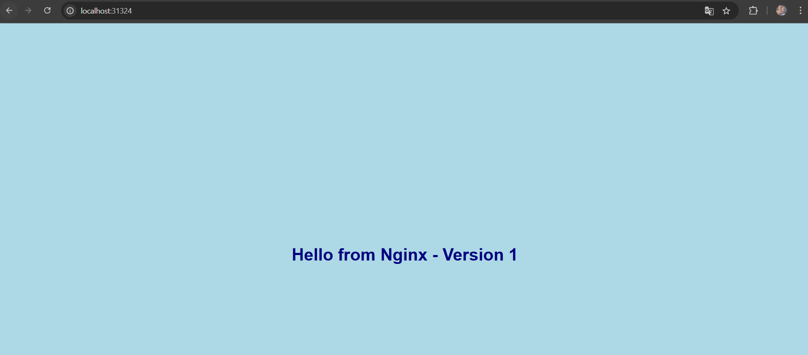
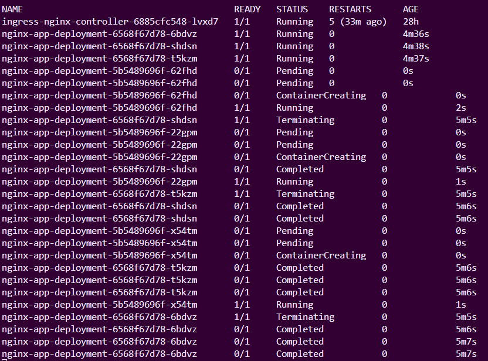
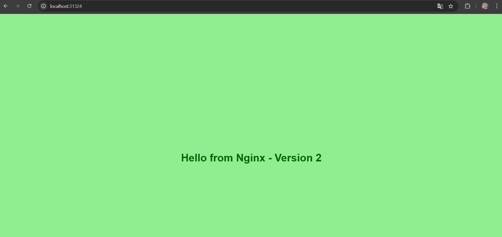

# Nginx Übung: Kubernetes Deployment, Service, Rolling Update & Rollback

Dieses Verzeichnis enthält die notwendigen Dateien und Anleitungen, um ein Nginx Deployment und einen Service in Kubernetes zu erstellen, ein Rolling Update durchzuführen und ein Rollback zu testen.

## Lernziele dieser Aufgabe:

Diese Übung zielt darauf ab, dir praktische Erfahrungen mit grundlegenden Kubernetes-Konzepten zu vermitteln:

1.  **Deployment-Definition in YAML schreiben und verstehen:**

    - **Erklärung:** Du lernst, wie man eine `Deployment`-Ressource definiert, die Kubernetes anweist, wie eine bestimmte Anzahl von Replikaten deiner Anwendung (Pods) erstellt und aktuell gehalten werden soll. Dies beinhaltet die Angabe des Container-Images, der Anzahl der Replikate und wie Pods für das Deployment identifiziert werden (Labels und Selektoren).
    - **In dieser Übung:** Du erstellst `nginx-deployment.yaml`, um Nginx-Container zu deployen.

2.  **Service-Definition (Typ NodePort) in YAML schreiben und verstehen:**

    - **Erklärung:** Du lernst, wie man eine `Service`-Ressource definiert, um einen stabilen Netzwerkendpunkt (IP-Adresse und Port) für deine Pods bereitzustellen. Der Typ `NodePort` macht deine Anwendung auf einem spezifischen Port auf jedem Node deines Clusters zugänglich, sodass du von außerhalb des Clusters darauf zugreifen kannst.
    - **In dieser Übung:** Du erstellst `nginx-service.yaml`, um dein Nginx-Deployment über einen NodePort extern erreichbar zu machen.

3.  **Verstehen, wie ein Deployment Pods über Labels selektiert und managt:**

    - **Erklärung:** Labels sind Schlüssel-Wert-Paare, die an Kubernetes-Objekte angehängt werden. Selektoren ermöglichen es, Objekte basierend auf diesen Labels auszuwählen. Deployments verwenden Selektoren, um zu wissen, welche Pods sie verwalten sollen.
    - **In dieser Übung:** Das Deployment `nginx-app-deployment` verwendet `spec.selector.matchLabels` mit `app: nginx-example`, um Pods zu finden, die in `spec.template.metadata.labels` ebenfalls `app: nginx-example` haben.

4.  **Verstehen, wie ein Service Pods über Labels selektiert und den Traffic weiterleitet:**

    - **Erklärung:** Ähnlich wie Deployments verwenden Services Selektoren, um die Gruppe von Pods zu identifizieren, an die der Netzwerkverkehr weitergeleitet werden soll.
    - **In dieser Übung:** Der Service `nginx-app-service` verwendet `spec.selector` mit `app: nginx-example`, um Anfragen an die Nginx-Pods weiterzuleiten, die vom Deployment verwaltet werden.

5.  **Ein Deployment und einen Service mit `kubectl apply` deployen:**

    - **Erklärung:** Du lernst den grundlegenden `kubectl apply -f <dateiname>.yaml` Befehl kennen, um Konfigurationen aus YAML-Dateien auf deinen Kubernetes-Cluster anzuwenden und Ressourcen zu erstellen oder zu aktualisieren.
    - **In dieser Übung:** Du wendest `nginx-deployment.yaml` und `nginx-service.yaml` an.

6.  **Die Skalierungs-, Rolling Update- und Rollback-Funktionen von Deployments praktisch anwenden:**

    - **Erklärung:**
      - **Skalierung:** Die Fähigkeit, die Anzahl der laufenden Pods einfach zu erhöhen oder zu verringern.
      - **Rolling Update:** Eine Strategie, um eine neue Version deiner Anwendung schrittweise auszurollen, indem alte Pods nach und nach durch neue ersetzt werden, ohne Ausfallzeit.
      - **Rollback:** Die Möglichkeit, schnell zu einer vorherigen, stabilen Version deiner Anwendung zurückzukehren, falls Probleme mit der neuen Version auftreten.
    - **In dieser Übung:** Du änderst das Image im Deployment, um ein Rolling Update auszulösen, und verwendest `kubectl rollout undo`, um ein Rollback durchzuführen.

7.  **Den Prozess eines Rolling Updates und Rollbacks in Kubernetes beobachten und verstehen:**

    - **Erklärung:** Du lernst, Befehle wie `kubectl rollout status` und `kubectl get pods -w` zu verwenden, um den Fortschritt von Updates und Rollbacks in Echtzeit zu verfolgen und zu verstehen, wie Kubernetes Pods beendet und startet.
    - **In dieser Übung:** Du wirst diese Befehle verwenden, um die Aktualisierungs- und Wiederherstellungsprozesse zu beobachten.

8.  **Die Kommunikation zwischen Service und Pods über den Label-Selektor verifizieren:**
    - **Erklärung:** Du stellst sicher, dass der Service den Traffic korrekt an die vom Deployment verwalteten Pods leitet, indem du die Anwendung über den NodePort des Services aufrufst.
    - **In dieser Übung:** Der erfolgreiche Aufruf der Nginx-Seite im Browser bestätigt diese Kommunikation.

## Verzeichnisstruktur

```
nginx-übung/
├── nginx-app-v1/
│   ├── Dockerfile
│   └── index.html
├── nginx-app-v2/
│   ├── Dockerfile
│   └── index.html
├── nginx-deployment.yaml
├── nginx-service.yaml
├── images/
│   ├── nginx1.png
│   ├── nginx2.png
│   └── update.png
└── README.md               # Diese Datei
```

## Anleitung:

### 1. Voraussetzungen prüfen & Lokales Cluster starten

- Stelle sicher, dass Docker installiert und läuft.
- Stelle sicher, dass `kubectl` installiert ist und auf dein lokales Kubernetes Cluster zeigt (Docker Desktop Kubernetes, Minikube oder Kind sollten laufen und `kubectl get nodes` sollte erfolgreich sein).
- Stelle sicher, dass du bei Docker Hub angemeldet bist (`docker login`). Du wirst deine Images dorthin pushen. Dein Docker Hub Username ist `mephisto1339` (dieser ist bereits in `nginx-deployment.yaml` eingetragen).

### 2. Vorbereitung: Zwei Versionen eines Nginx Images bauen & pushen

Die Verzeichnisse `nginx-app-v1` und `nginx-app-v2` enthalten jeweils eine `index.html` und ein `Dockerfile`.

- `nginx-app-v1/index.html`: Zeigt "Hello from Nginx - Version 1" mit hellblauem Hintergrund.
- `nginx-app-v2/index.html`: Zeigt "Hello from Nginx - Version 2" mit hellgrünem Hintergrund.
- Die `Dockerfile`s kopieren die jeweilige `index.html` in ein `nginx:latest` Image.

**Befehle (aus dem Hauptverzeichnis `node-container` ausführen oder Pfade anpassen, wenn du dich bereits in `kubernetes/nginx-übung` befindest):**

1.  **Baue die zwei Images:**

    ```bash
    # Wenn du im Verzeichnis 'node-container' bist:
    docker build -t mephisto1339/nginx-example:v1 ./kubernetes/nginx-übung/nginx-app-v1
    docker build -t mephisto1339/nginx-example:v2 ./kubernetes/nginx-übung/nginx-app-v2

    # Wenn du bereits in 'node-container/kubernetes/nginx-übung' bist:
    # docker build -t mephisto1339/nginx-example:v1 ./nginx-app-v1
    # docker build -t mephisto1339/nginx-example:v2 ./nginx-app-v2
    ```

2.  **Pushe die beiden Images auf Docker Hub:**
    ```bash
    docker push mephisto1339/nginx-example:v1
    docker push mephisto1339/nginx-example:v2
    ```

### 3. Kubernetes Manifeste erstellen (YAML)

Die Manifeste sind bereits in diesem Verzeichnis (`kubernetes/nginx-übung/`) vorhanden:

- **`nginx-deployment.yaml`**:
  - Definiert ein Deployment namens `nginx-app-deployment`.
  - Startet mit 3 Replikaten.
  - Verwendet das Label `app: nginx-example` für den Selector und die Pod-Vorlage.
  - Nutzt initial das Image `mephisto1339/nginx-example:v1`.
  - Der Container lauscht auf Port `80`.
- **`nginx-service.yaml`**:
  - Definiert einen Service namens `nginx-app-service`.
  - Ist vom Typ `NodePort`.
  - Selektiert Pods mit dem Label `app: nginx-example`.
  - Mappt den Service-Port `80` auf den Container-Port `80`.

### 4. Anwendung in Kubernetes deployen

1.  Navigiere im Terminal in dieses Verzeichnis (`kubernetes/nginx-übung/`).
2.  Deploye das Deployment und den Service:
    ```bash
    kubectl apply -f nginx-deployment.yaml
    kubectl apply -f nginx-service.yaml
    ```

### 5. Initiales Deployment überprüfen

1.  **Überprüfe den Status deines Deployments:**

    ```bash
    kubectl get deployment nginx-app-deployment
    ```

    Warte, bis 3/3 Replikate als `READY` angezeigt werden.

2.  **Überprüfe den Status der Pods:**

    ```bash
    kubectl get pods -l app=nginx-example
    ```

    Warte, bis alle 3 Pods den Status `Running` haben.

3.  **Überprüfe den Status deines Service und finde den zugewiesenen NodePort:**

    ```bash
    kubectl get service nginx-app-service
    ```

    Notiere den `NodePort` aus der Ausgabe (z.B. `80:31324/TCP`, hier wäre `31324` der NodePort).

4.  **Finde die IP-Adresse deines Worker Nodes:**
    (Bei Minikube: `minikube ip`. Bei Docker Desktop ist es oft `localhost` oder die IP der Docker Desktop VM.)

    ```bash
    kubectl get nodes -o wide
    ```

    Notiere die `INTERNAL-IP` eines Nodes. **Wenn du Docker Desktop verwendest und Kubernetes dort läuft, verwende für den nächsten Schritt `localhost` als Node-IP.**

5.  **Öffne deinen Browser** und rufe `http://<Node-IP>:<NodePort>` auf (z.B. `http://localhost:31324` bei Docker Desktop, oder `http://<INTERNAL-IP-des-Nodes>:<NodePort>` bei anderen Setups). Du solltest die Nginx-Seite deiner **Version 1** sehen (hellblauer Hintergrund).

    

### 6. Rolling Update durchführen

1.  **Bearbeite die Datei `nginx-deployment.yaml`** in diesem Verzeichnis. Ändere das Container-Image von:
    `image: mephisto1339/nginx-example:v1`
    zu:
    `image: mephisto1339/nginx-example:v2`
    Speichere die Datei.

2.  **Wende die geänderte Deployment-Definition an:**

    ```bash
    kubectl apply -f nginx-deployment.yaml
    ```

3.  **Beobachte den Rollout-Prozess:**

    ```bash
    kubectl rollout status deployment/nginx-app-deployment
    ```

    (Zeigt den Fortschritt an, bis "deployment "nginx-app-deployment" successfully rolled out" erscheint.)
    Du kannst auch parallel in einem anderen Terminal beobachten:

    ```bash
    kubectl get pods -l app=nginx-example -w
    ```

    (Sieh zu, wie die alten Pods (`v1`) beendet und neue Pods (`v2`) gestartet werden.)

    Ungefähr so sollte die Ausgabe von `kubectl get pods -w` während des Updates aussehen:
    

4.  Wenn der Rollout abgeschlossen ist, **rufe die Adresse im Browser neu auf** (`http://<Node-IP>:<NodePort>`). Du solltest nun die Nginx-Seite deiner **Version 2** sehen (hellgrüner Hintergrund). Lade die Seite ggf. mehrmals, um sicherzustellen, dass alle Pods aktualisiert wurden.

    

### 7. Rollback durchführen

Angenommen, Version 2 hat Probleme und du möchtest zur vorherigen Version zurückkehren.

1.  **Führe ein Rollback zum vorherigen Deployment durch:**

    ```bash
    kubectl rollout undo deployment/nginx-app-deployment
    ```

2.  **Beobachte den Rollback-Prozess:**

    ```bash
    kubectl rollout status deployment/nginx-app-deployment
    ```

    Und/oder:

    ```bash
    kubectl get pods -l app=nginx-example -w
    ```

3.  Wenn der Rollback abgeschlossen ist, **rufe die Adresse im Browser neu auf**. Du solltest wieder die Nginx-Seite deiner **Version 1** sehen (hellblauer Hintergrund).

### 8. Aufräumen

Lösche das Deployment und den Service, um die erstellten Ressourcen zu entfernen.

1.  **Lösche die Ressourcen:**

    ```bash
    kubectl delete -f nginx-deployment.yaml
    kubectl delete -f nginx-service.yaml
    ```

    Oder zusammen:

    ```bash
    kubectl delete -f nginx-deployment.yaml,nginx-service.yaml
    ```

2.  **Überprüfe, ob die Ressourcen entfernt wurden:**

    ```bash
    kubectl get deployment,service,pods -l app=nginx-example
    ```

    Sollte "No resources found" oder Ähnliches für die jeweiligen Typen anzeigen.

3.  **Stoppe dein lokales Cluster** (optional, aber empfohlen, um Ressourcen zu sparen):
    - Für Minikube: `minikube stop`
    - Für Docker Desktop: Deaktiviere Kubernetes in den Docker Desktop Einstellungen.

## Reflexion

### Warum ist ein Deployment in Kubernetes nicht einfach nur eine etwas andere Version von `docker run` mit `--restart=always`?

Ein `docker run --restart=always` Befehl kümmert sich nur um einen einzelnen Container auf einem einzelnen Host. Wenn dieser Container ausfällt, wird er neu gestartet. Das ist zwar nützlich, aber ein Kubernetes Deployment, wie unser `nginx-app-deployment`, bietet weit mehr:

- **Deklarativer Zustand:** Wir definieren in der `nginx-deployment.yaml`, _wie viele_ Replikate unserer Nginx-Anwendung laufen sollen (z.B. 3) und _welche Version_ (z.B. `mephisto1339/nginx-example:v1`). Kubernetes sorgt dann dafür, diesen Zustand aktiv aufrechtzuerhalten.
- **Skalierbarkeit:** Wir können die Anzahl der `replicas` einfach ändern, und das Deployment kümmert sich darum, Pods hinzuzufügen oder zu entfernen.
- **Rolling Updates & Rollbacks:** Wie in der Übung gesehen, ermöglicht ein Deployment kontrollierte Updates auf eine neue Version (z.B. von `v1` auf `v2` unseres Nginx-Images) und bei Bedarf ein Zurückrollen zur vorherigen Version, ohne dass der Service komplett ausfällt.
- **Selbstheilung über mehrere Pods:** Fällt einer der Nginx-Pods aus, startet das Deployment automatisch einen neuen, um die gewünschte Anzahl an Replikaten sicherzustellen.
- **Verwaltung von Pod-Vorlagen:** Das Deployment definiert eine Vorlage (`spec.template`) für die Erstellung der Pods, inklusive Container-Images, Ports und Labels.

Ein Deployment ist also ein intelligenter Controller, der eine ganze Gruppe von Anwendungsinstanzen managt, deren Lebenszyklus überwacht und für Hochverfügbarkeit und einfache Aktualisierungen sorgt – weit über das hinaus, was ein einfacher Docker-Neustart leisten kann.

### Was tut das Deployment, wenn ein Pod plötzlich verschwindet – und warum ist das nicht einfach nur Magie?

Wenn einer unserer Nginx-Pods (z.B. einer der drei Replikate des `nginx-app-deployment`) plötzlich verschwindet – sei es durch einen Node-Ausfall, einen internen Fehler im Pod oder manuelles Löschen – passiert Folgendes:

1.  Der **Deployment Controller** überwacht kontinuierlich die Anzahl der laufenden Pods, die zu seinem `selector` (in unserem Fall `app: nginx-example`) passen.
2.  Er stellt fest, dass die aktuelle Anzahl der laufenden Pods (z.B. 2) nicht mehr mit der in `spec.replicas` definierten gewünschten Anzahl (z.B. 3) übereinstimmt.
3.  Um diesen Unterschied auszugleichen und den deklarierten Zustand wiederherzustellen, weist der Deployment Controller das zugehörige **ReplicaSet** an, einen neuen Pod gemäß der `spec.template` des Deployments zu erstellen.
4.  Ein neuer Nginx-Pod wird gestartet, sodass wieder die gewünschten 3 Replikate laufen.

Das ist keine Magie, sondern das Ergebnis der kontinuierlichen **Abgleichschleife (Reconciliation Loop)**, die ein Kernprinzip von Kubernetes ist. Controller arbeiten ständig daran, den tatsächlichen Zustand des Clusters mit dem vom Benutzer deklarierten gewünschten Zustand in Einklang zu bringen.

### Was konntest du beim Rolling Update mit `kubectl get pods -w` beobachten – und wie wird hier sichergestellt, dass es keinen kompletten Ausfall gibt?

Beim Rolling Update von `mephisto1339/nginx-example:v1` auf `v2` konnte man mit `kubectl get pods -l app=nginx-example -w` Folgendes beobachten:

1.  Zuerst liefen drei Pods mit dem alten Image (`v1`).
2.  Nach dem `kubectl apply -f nginx-deployment.yaml` mit dem geänderten Image-Tag begann Kubernetes, neue Pods mit dem `v2`-Image zu erstellen. Man sah einen neuen Pod im Status `ContainerCreating`, dann `Running`.
3.  Sobald ein neuer `v2`-Pod lief und bereit war (`READY 1/1`), begann Kubernetes, einen der alten `v1`-Pods zu beenden. Man sah einen `v1`-Pod in den Status `Terminating` wechseln und schließlich verschwinden.
4.  Dieser Prozess wiederholte sich: Ein neuer `v2`-Pod wurde gestartet, dann ein alter `v1`-Pod beendet, bis alle drei laufenden Pods die neue `v2`-Version hatten.

So wird sichergestellt, dass es keinen kompletten Ausfall gibt:

- **Schrittweise Aktualisierung:** Nicht alle alten Pods werden gleichzeitig gestoppt.
- **Verfügbarkeit wird aufrechterhalten:** Es wird standardmäßig darauf geachtet, dass immer eine bestimmte Mindestanzahl an Pods verfügbar ist (gesteuert durch `maxUnavailable`) und nicht zu viele neue Pods gleichzeitig gestartet werden (gesteuert durch `maxSurge` in der Deployment-Strategie). In unserer Übung mit 3 Replikaten und den Standardeinstellungen bedeutet das typischerweise, dass ein neuer Pod hochfährt, bevor ein alter heruntergefahren wird, oder dass maximal ein Pod nicht verfügbar ist. Dadurch kann der `nginx-app-service` den Traffic weiterhin an die verbleibenden laufenden Pods (alte oder neue) leiten.

### Wie sorgt der Kubernetes-Service dafür, dass dein Browser-Ping (über NodePort) den richtigen Pod trifft – selbst wenn sich gerade ein Update vollzieht?

Der `nginx-app-service` sorgt so dafür, dass Anfragen über den NodePort (z.B. `http://localhost:31324`) auch während eines Updates die richtigen, laufenden Nginx-Pods erreichen:

1.  **Label-Selektor:** Der Service ist in seiner YAML-Definition (`nginx-service.yaml`) mit einem `selector` konfiguriert, in unserem Fall `app: nginx-example`.
2.  **Endpoint-Überwachung:** Kubernetes (genauer gesagt, der Endpoints Controller) überwacht kontinuierlich alle Pods im Cluster. Es identifiziert alle Pods, die die Labels des Service-Selektors tragen (also `app: nginx-example`) UND die bereit sind, Traffic zu empfangen (d.h., sie sind `Running` und haben ihre Readiness-Probe bestanden, falls konfiguriert).
3.  **Dynamische Endpoint-Liste:** Der Service hält eine dynamische Liste dieser bereiten Pods als seine "Endpoints". Wenn ein neuer `v2`-Pod während des Rolling Updates startet und bereit ist, wird er dieser Liste hinzugefügt. Wenn ein alter `v1`-Pod terminiert wird, wird er aus der Liste entfernt.
4.  **Load Balancing:** Wenn eine Anfrage beim Service (über den NodePort) ankommt, leitet der Service diese Anfrage per Load Balancing an einen der _aktuell in seiner Endpoint-Liste geführten, bereiten Pods_ weiter.

Da die Endpoint-Liste dynamisch aktualisiert wird, um nur die gesunden und bereiten Pods (egal ob `v1` oder `v2` während des Übergangs) zu enthalten, stellt der Service sicher, dass Anfragen immer an eine funktionierende Instanz unserer Nginx-Anwendung geleitet werden.

### In der Deployment-YAML: Welche Angaben betreffen die Pod-Vorlage, und welche regeln das Verhalten des Deployments (z.B. Skalierung, Strategie)?

In unserer `nginx-deployment.yaml`:

```yaml
apiVersion: apps/v1
kind: Deployment
metadata:
  name: nginx-app-deployment # Name des Deployments
spec: # Hier beginnt die Spezifikation des Deployments
  replicas: 3 # ⚙️ Verhalten des Deployments: Wie viele Pods sollen laufen?
  selector: # Verhalten des Deployments: Welche Pods gehören zu diesem Deployment?
    matchLabels:
      app: nginx-example
  # strategy: (implizit RollingUpdate mit Defaults) # Verhalten des Deployments
  template: #  Pod-Vorlage: Wie soll jeder einzelne Pod aussehen?
    metadata: # Metadaten für die Pods, die erstellt werden
      labels: # Labels für die Pods (müssen zum selector passen)
        app: nginx-example
    spec: # Spezifikation für die Pods
      containers: # 📦 Definition der Container innerhalb des Pods
        - name: nginx
          image: mephisto1339/nginx-example:v1 # Welches Image?
          ports:
            - containerPort: 80 # Welchen Port stellt der Container bereit?
```

- **Pod-Vorlage (`spec.template`)**: Alles innerhalb von `spec.template` definiert, wie ein einzelner Pod, der von diesem `nginx-app-deployment` verwaltet wird, aufgebaut sein soll. Das umfasst:

  - `spec.template.metadata.labels`: Die Labels (`app: nginx-example`), die jedem Pod gegeben werden.
  - `spec.template.spec.containers`: Die Definition der Container 📦 innerhalb des Pods, hier unser `nginx`-Container mit dem Image (`mephisto1339/nginx-example:v1`) und dem `containerPort: 80`.

- **Verhalten des Deployments (direkt unter `spec`, außerhalb von `template`)**: Diese Angaben steuern, wie das `nginx-app-deployment` selbst agiert:
  - `spec.replicas: 3` ⚙️: Gibt an, dass das Deployment drei identische Pods (basierend auf der Vorlage) erstellen und verwalten soll.
  - `spec.selector.matchLabels`: Definiert, welche Pods (die mit dem Label `app: nginx-example`) zu diesem Deployment gehören und von ihm verwaltet werden.
  - `spec.strategy` (auch wenn in unserer Datei nicht explizit mit allen Details aufgeführt, wird standardmäßig `RollingUpdate` verwendet): Bestimmt, wie Updates durchgeführt werden (z.B. schrittweise Ersetzung der Pods).

### Was passiert mit den Pods, wenn du das Deployment löschst – und warum ist das Verhalten logisch?

Wenn du das `nginx-app-deployment` löschst (z.B. mit `kubectl delete -f nginx-deployment.yaml`):

1.  Das Kubernetes-System erhält die Anweisung, die Ressource `Deployment` mit dem Namen `nginx-app-deployment` zu entfernen.
2.  Der Deployment Controller erkennt, dass dieses Deployment nicht mehr existieren soll.
3.  Da das Deployment die "Blaupause" und der Manager für die Nginx-Pods war, die das Label `app: nginx-example` tragen, ist die logische Konsequenz, dass auch diese verwalteten Pods nicht mehr benötigt werden.
4.  Das Deployment (bzw. das von ihm gesteuerte ReplicaSet) skaliert die Anzahl der zugehörigen Pods auf 0 herunter.
5.  Die Nginx-Pods erhalten ein Terminationssignal, werden ordnungsgemäß heruntergefahren und schließlich gelöscht.

Dieses Verhalten ist logisch, weil Kubernetes einem **deklarativen Ansatz** folgt. Du deklarierst den gewünschten Zustand (z.B. "ich möchte ein Deployment namens `nginx-app-deployment`, das 3 Nginx-Pods betreibt"). Wenn du diese Deklaration (das Deployment-Objekt) löschst, sagst du Kubernetes: "Ich möchte diesen Zustand nicht mehr." Kubernetes entfernt dann alle Ressourcen (die Pods), die es erstellt hat, um diesen nicht mehr gewünschten Zustand zu erfüllen. Es räumt sozusagen hinter sich auf, um das System konsistent zu halten.
